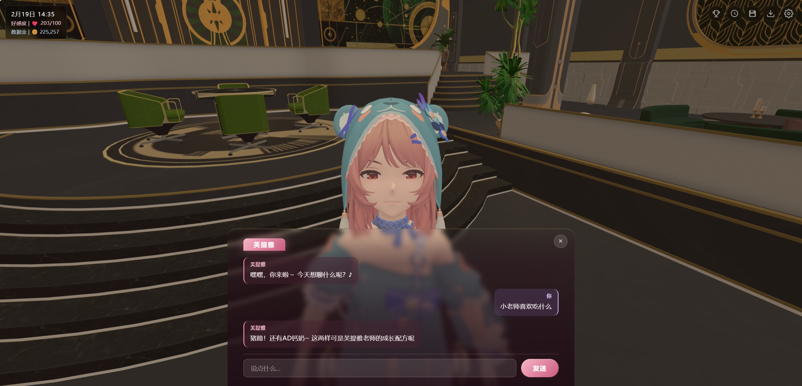

<div align="center">

# 芙提雅 Online NEXT

*_✨ [**芙提雅 AI Bot**](https://qingchenwait.github.io/fritia_online_guide) 次世代进化版&emsp;/&emsp;3D 互动场景&emsp;约会系统&emsp;LLM 对话&emsp;网页直达 ✨_*

[](https://threejs.org/)

[](https://space.bilibili.com/385556208/)

*_💖 对你的爱，跨越空间 💖_*



</div>

## 核心功能

- **🎮 3D 小老师**：芙提雅 ONLINE，现以 3D 游戏方式推出！以第一人称，与芙提雅进行各种亲密互动吧 ~
- **💕 LLM 驱动的恋爱活动**：游戏剧情由 LLM 驱动，不可预测的对话、约会、送礼等恋爱活动，新鲜感满满！
- **💬 丰富的交互功能**：房间内的家具基本都可以交互，各种有趣小功能等您探索！
- **🏆 成就系统**：多个有趣的成就内容，包含隐藏成就。
- **💾 存档导入导出**：可以把聊天记录、礼物等数据导出备份，方便跨设备游戏。 <br /> ( **注意**：清理浏览器网站数据可能会**删除本地存档**！请务必经常[**备份存档**](#游戏存档备份导入和导出) )

## 游玩方法

### 方法一：GitHub Pages 在线游玩

打开下面的网址，等待加载完成后即可游玩：

[https://qingchenwait.github.io/Fritia_Online_NEXT/](https://qingchenwait.github.io/Fritia_Online_NEXT/)

开始游戏前，请先点击右上角 [设置] 按钮，配置本游戏中使用的 LLM 大模型：

- 需要**自行获取大模型 API**，并充值额度。可使用 [DeepSeek](https://platform.deepseek.com/api_keys)、[MiMO](https://platform.xiaomimimo.com/console/api-keys) 等模型。
- 在设置中，填写 OpenAI 兼容 API 的 `API Key`、`Base URL` 和模型名称。
- 数据只保存在你的浏览器本地，不会上传云端。

### 方法二：下载源码本地部署

如果希望在你的本地电脑中，部署芙提雅 ONLINE NEXT，请参考以下教程，配置本地网页服务器并运行源码：

#### Windows

1. 安装 Node.js LTS：
   https://nodejs.org/

2. 下载源码：
   - 如果你的本地电脑里安装了 Git，可以运行：

        ```bash
        git clone https://github.com/QingChenWait/Fritia_Online_NEXT.git
        cd Fritia_Online_NEXT
        ```

   - 如果没有安装 Git，也可以在 GitHub 页面点击 `Code` -> `Download ZIP`，解压后进入项目文件夹。

     随后，打开项目文件夹的**根目录** (可以看到 `index.html`、`README.md` 等文件)，点击鼠标右键，选择 “在终端中打开”。

3. 启动本地服务器：

    ```bash
    npm run start
    ```

4. 浏览器打开：

    ```text
    http://localhost:3000
    ```

#### macOS

1. 安装 Node.js LTS：
   https://nodejs.org/

2. 下载源码：
   - 如果你的本地电脑里安装了 Git，可以打开“终端”运行：

        ```bash
        git clone https://github.com/QingChenWait/Fritia_Online_NEXT.git
        cd Fritia_Online_NEXT
        ```

   - 如果没有安装 Git，也可以在 GitHub 页面点击 `Code` -> `Download ZIP`，解压后进入项目文件夹。

     随后，打开项目文件夹的**根目录** (可以看到 `index.html`、`README.md` 等文件)，在该文件夹中打开终端。

3. 启动本地服务器：

    ```bash
    npm run start
    ```

4. 浏览器打开：

    ```text
    http://localhost:3000
    ```

首次运行 `npm run start` 时，系统可能会提示下载 `serve` 工具，输入 `y` 确认即可。

## 游戏存档备份、导入和导出

游戏数据默认保存在当前浏览器本地，包括：

- API 设置
- 日常对话历史
- 约会对话历史
- 游戏时间
- 数据金余额
- 好感度
- 礼物记录
- 成就进度

**导出备份**：

1. 点击右上角“导出”按钮。
2. 浏览器会下载一个 `fritia_backup_日期时间.json` 文件。
3. 请把这个文件保存到安全的位置。

**导入备份**：

1. 点击右上角“导入”按钮。
2. 选择之前导出的 `fritia_backup_*.json` 文件。
3. 页面提示导入成功后，建议刷新网页，让设置完整生效。

**注意事项**：

- 不同浏览器、不同设备的本地存档互不共享，需要手动导出和导入。
- **清理浏览器网站数据可能会删除本地存档**，请提前导出备份。
- 导入存档时，礼物记录会增量合并；好感度会保留本地和导入文件中更高的数值。
